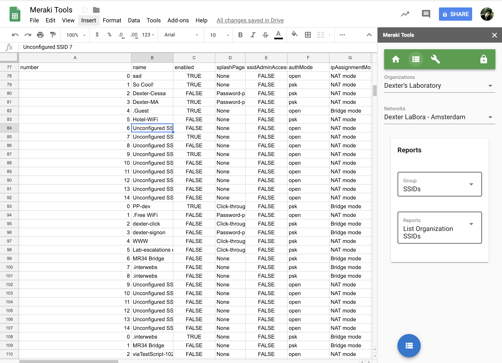

# Meraki Tools for Google Sheets

## About

Meraki Tools is an application to generate reports and makes adjustments for the Meraki Cloud platform. This version is built to support Google Sheets as a Sidebar Add-on. This allows you to instantly generate reports into a Google Sheet, then take advantage many features of the Sheet such as using the Explore feature to illustrate the Meraki data.

Google Add-on Marketplace Link

[Get Add-on](https://cs.co/meraki_tools)

## Key Technologies

- [Meraki Dashboard API](https://meraki.io/api)
- [VueJS](https://vuejs.org) w/ [Vuetify](https://vuetifyjs.com)
- Webpack & Google Apps Script (GAS) deploy scripts



## Features

- Reports
  - **200+ Meraki Dynamic Reports**
    - Dynamic form selectors (Orgs, Nets, Devices, Clients, etc.)
  - Custom Meraki Reports (iterations, enhanced results)
- Custom Tools
  - Create Client
  - Configure SSIDs
  - Configure VLANs
  - Claim Order

## Installation (Development)

If you would like to enhance this tool, you could clone this project and deploy your own version to a Google Sheet and even publish your own Add-on.

### Pre-reqs

- [Yarn](https://yarnpkg.com/en/): Node Package Manager..but with some enhancements

  - [install guide](https://yarnpkg.com/en/docs/install)


- **Clasp**: Utility to push scripts to Google

  `npm install @google/clasp -g`

- Once `clasp` is installed, you will need to login to Google from the command line. It will prompt you to complete the login via a web page. 
  
```
clasp login
```

### Install

```
git clone <this repo>
cd <this repo>
yarn
```

### Configure

First, create a blank [Google Sheet](https://sheets.new), then go to **Tools** --> **Script editor**.
Save the default script with a name. Then, obtain the `scriptId` by going to **File** --> **Project settings**

Update `clasp/.clasp.json`, setting `scriptId` to your Google project's ID 


### Local Development

```
yarn serve
```

> A local development proxy server will run on http://localhost:8080, be sure to update your API Base URL in the running application with your local URL.

This will not only serve a local instance of the application but it will also forward all Meraki API requests where the path begins with `/api` to the local proxy server. These requests will then make be forwarded to `https://api.meraki.com/api/v0`.

### Deploy to Production
First ensure that you have the [Google clasp](https://developers.google.com/apps-script/guides/clasp) tool installed.
```
npm install @google/clasp -g
```

Then, login to your Google account from the command line within your project.
```
clasp login
```
- Create a new [Google Sheet](https://sheets.new)
- Create a Script for the sheet (Tools --> Script editor)
- Save blank the sheet & script file.
- Note the Project ID in File --> Project properties --> Script ID

Update the `./clasp.json` file with the your Script ID

```
yarn deploy
```

This will modify the the native Meraki SDK to use a custom Google App Script helper `scripts/api-to-gas.sh` to force the Meraki SDK to use Google as the API request resolver as opposed to contacting Meraki directly from the client side appliction. We do this because of the CORS policy enforced by the Meraki cloud.

# Developer Notes

## Google Apps Script Bootstrap

[gas-ts-vue-webpack](https://github.com/MattiasMartens/gas-ts-vue-webpack.git)

This app was built using an open source repo for bootstraping Google Apps Scripts

- **Google Apps Script** A JS based language for interacting with Google Apps.
- **Clasp** lets you push your entire locally managed project to Google Apps Script project - no more copy and paste! (See <https://codelabs.developers.google.com/codelabs/clasp/#1> for installation instructions.)
- **TypeScript** gives compile-time type-checking
- **Vue** provides a framework for rapid development of an interactive front-end for the app
- **Webpack** bundles the backend and frontend code into two bundles of ES5 JavaScript

## Webpack Notes

- The bundled frontend code goes to `clasp/dist/index.js.html` which is then loaded into the HTML template in `clasp/index.html`. Unfortunately, Google Apps Script does not let you serve raw JavaScript code - it must be treated as raw HTML. Accordingly, HTML-semantic characters like `<` and `>` are escaped which naturally breaks the code. The best and only fix I have found is to wrap the generated bundle in a `<script>` tag, turning it into valid HTML that does not need to be escaped. This is accomplished with the Webpack Shell Plugin and `scripts/wrap-in-script.sh`.

- Babble is used to convert modern JavaScript to a common browser supported version.

## App Structure

If you would like to extend or better understand this project, here are the important files and their purpose. Any files not listed, you should only adjust if you know what you are doing. This application is somewhat complicated because of the necessary mechanics to run as a Google Apps Add-on for Sheets. The core concepts, generally located in the `/src` folder could be run independently or in other environments with a little massaging.

- `/api-to-gas/`: Meraki SDK override to support Google Apps Scripts. Used with `yarn build/deploy`
- `/clasp/`: template files for Google Apps Script. Used with `yarn build/deploy`
- `/public/`: static assets for website
- `/scripts/`: used with `npm run ...` to prepare for build/deploy
- `/src`: primary VueJS application source files

  - `assets/`: static files, images, etc.
  - `components/`: main application files "business logic"
    - `pages/`: VueJS pages
      - `reports-auto-oas.vue`: Dynamic reports using the OpenAPI spec. **_The most interesting file_**
      - `reports.vue`: Custom reports using Meraki SDK
      - `tools`: navigation for tool components to make changes on a Meraki network
      - `settings`: define the API key & URL and misc. settings.
    - `shared/`: Common components used by the app including various Meraki `selectors` that many times query the Meraki API to present available options relative to the current form scope.
    - `app.vue`: primary layout (nav, reports, tools, settings, etc)
    - `main.js`: start of application, loads dependencies and launches default components
    - `nav-menu`: top navigation
    - `router.ts`: routes to key features (home., reports, tools, etc.)
    - `store.js`: manages state of application (apiKey, apiUrl, org, net, etc.)
    - `utilities`: misc. utility functions used in the app.

- `/`: misc core files
  - `package.js`: Application dependencies
  - `vue.config.js`: Defines the Meraki API proxy address
  - `webpack.config.js`: Build/Deploy configuration

## Created By:

Cory Guynn - 2019

Github: @dexterlabora

Twitter: @eedionysus
