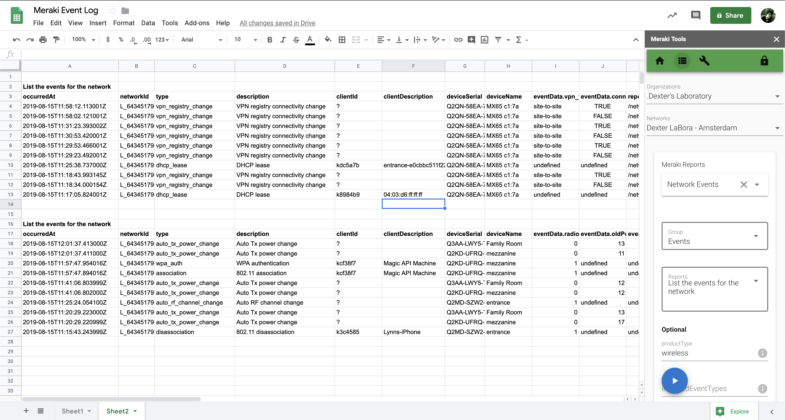

# Meraki Tools for Google Sheets

## About

Meraki Tools is an Google Sheets Add-on to generate reports and makes adjustments for the Meraki Cloud platform. This allows you to instantly generate reports into a spreadsheet, then take advantage of the many features of Google Sheets such as using the Explore feature to visualize the Meraki data.

> [Download Add-on](https://cs.co/meraki_tools)

---

### See it in action

## Key Technologies

[Meraki Dashboard API](https://meraki.io/api)

## Features

- Reports
  - **200+ Meraki Dynamic Reports**
    - Dynamic form selectors (Orgs, Nets, Devices, Clients, etc.)
  - Custom Meraki Reports (iterations, enhanced results)
- Custom Tools
  - Create Client
  - Configure SSIDs
  - Configure VLANs
  - Claim Order

## System Requirements
The following is the system requirement that must be met before using the add-on:

- A recent version of Firefox, Google Chrome, or Internet Explorer 10 or later.
- Meraki Dashboard account with API key. [Getting Started](https://developer.cisco.com/meraki/meraki-platform/)

## Privacy Policy
The add-on is subject to the standard Google Privacy Policy. As with all cloud services, don't store data on Google servers that you don't want Google, Inc. to have access to. No information is stored outside of the running instance of the application within the active Google Sheet.

## Terms of Service
The add-on is free for public use with no guarantees or official support. The project is open source utlizing the Apache license. 

## Installation
To install the Meraki Tools add-on, follow these steps:

Open a Google Sheets spreadsheet.
Under the Add-ons menu, select "Get add-ons..."
Within the dialog that appears, search for "Meraki Tools".
Click the "+ Free" button to install.
After installing, a tooltip will appear pointing at the Add-ons menu. Select "Launch Main Menu" to begin using the side-bar tool.

## Usage
- First update the application with an API key to your Meraki account. This can be done by selecting the "lock" icon and then paste your API key in the input field. Clicking anywhere else on the screen will save your changes. You can also force an organization refresh, to pull in any changes. 
- Run a report by first selecting the destination cell in the Sheet, then navigate to the Reports menu and search for a report to run. Pressing the blue play button will run the report for the selected Organizaion/Network. 
- Looper is a special widget that will allow you to run a report over multiple organizations, networks or serials depending on the report requirements. 

## Technical Support
This add-on is an open source project. You can submit issues [here](https://github.com/dexterlabora/meraki-tools-gas-vue-webpack/issues) or submit pull requests with any proposed enhancements. 

## Created By:

Cory Guynn - 2019

Github: @dexterlabora

[GitHub Repository](https://github.com/dexterlabora/meraki-tools-gas-vue-webpack)

